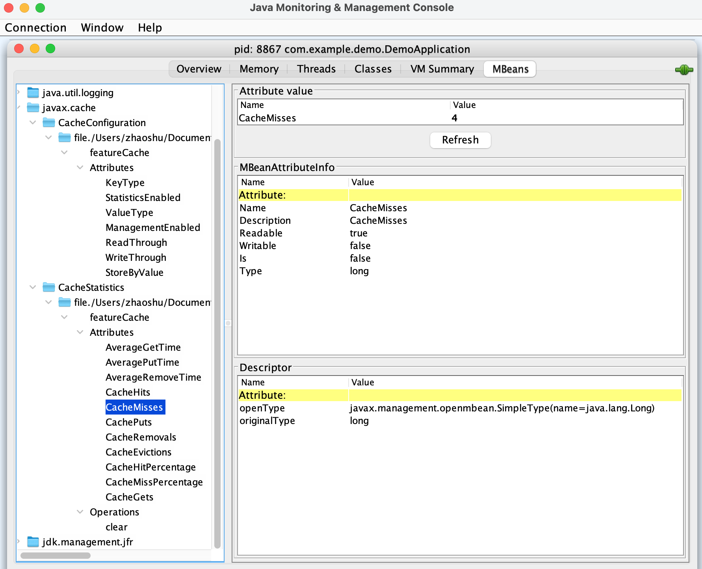

# Spring Cache Demo

## Test

1. Start the embedded servlet container after starting MySQL:
```bash
./gradlew bootRun
```

2. Save the data:
```bash
curl -X POST http://localhost:8080/features -H 'Content-Type: application/json' -d '{"featureKey":"key", "featureValue": "value"}'
```

3. Query the saved data by its key:
```bash
curl http://localhost:8080/features/key
```

4. Update the saved data by its key:
```bash
curl -X PUT http://localhost:8080/features/key -H 'Content-Type: application/json' -d '{"featureValue": "updatedValue"}'
```

5. Delete the saved data by its key:
```bash
curl -X DELETE http://localhost:8080/features/key
```

6. Check the cache:
```bash
curl http://localhost:8080/caches/key
```

7. Check the JMX monitor:
```bash
$ jps
834 GradleDaemon
8867 DemoApplication
8855 GradleWrapperMain
343 
8893 Jps

$ jconsole 8867
```

<p float="left">
    
</p>

## References
* https://start.spring.io/
* https://adoptopenjdk.net/installation.html
* https://www.ehcache.org/documentation/3.2/107.html
